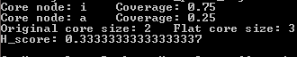

# houglass-celegans

# The hourglass organization of the _{Caenorhabditis elegans}
> We approach the _{C. elegans}_ connectome as an information processing network that receives input from about 90 sensory neurons, processes that information through a highly recurrent network of about 80 interneurons, and it produces a coordinated output from about 120 motor neurons that control the nematode's muscles.
We focus on the feedforward flow of information from sensory neurons to motor neurons, and
apply a recently developed network analysis framework referred to as the "hourglass effect". 
The analysis reveals that this feedforward flow traverses a small core ("hourglass waist") that consists of 10-15 interneurons. These are mostly the same interneurons that were previously shown (using a different analytical approach) to constitute the "rich-club" of the _{C. elegans}_ connectome.
This result is robust to the methodology that separates the feedforward from the feedback flow of information. 
The set of core interneurons remains mostly the same when we consider only chemical synapses or the combination of chemical synapses and gap junctions.
The hourglass organization of the connectome suggests that 
_{C. elegans}_ has some similarities with encoder-decoder artificial neural networks in which the input is first compressed and integrated in a low-dimensional latent space that encodes the given data in a more efficient manner, followed by a decoding network through which intermediate-level sub-functions are combined in different ways to compute the correlated outputs of the network. The core neurons at the hourglass waist represent 
the _{information bottleneck}_ of the system, 
balancing the representation accuracy and compactness 
(complexity) of the given  sensory information.

* Last update: November-2019 
* Corresponding Paper: [The hourglass organization of the _{Caenorhabditis elegans}](https://www.biorxiv.org/content/biorxiv/early/2019/04/07/600999.full.pdf)
* [PLOS Computational Biology Journal] Accepted for publication
* [Author Homepage](http://sites.google.com/site/kmsabrin)

#### 0. Requirements

* Java 7 or greater

#### 1. How to Run

```
javac HourglassAnalysisPathBased.java
java HourglassAnalysisPathBased path_file 0.9
```

_path_file_ consists of source-target paths one per line, with node identifiers separated by whitespace.
A sample path file for the network depicted above is provided: _'all_paths_toy'_

The ouput lists the core nodes for the given path coverage threshold (_0.9_ above), followed by the H-score.

The output from the above run with _'all_paths_toy'_ is following:




#### 2. Generating Paths

Given a network, we want to generate paths that are at most _k_ hops larger than the shortest paths between each pair of source-target nodes. If _k=0_, we get the all possible shortest paths between each pair of source-target nodes and if _k=2_, then for each pair of source-target nodes, we get all possible paths between them that are at most _2_ hops larger than their shortest path hop distance. Note that the network does not have to be acyclic. 

To run:
```
javac HourglassAnalysis.java
java HourglassAnalysis edge_list source_list target_list +k
```

_edge_list_, _source_list_ and _target_list_ are as described earlier. 
_k_ can take any value _>= 0_. 
Note that the '+' is required in the fourth input parameter. 
A output file wil be created named _'paths.txt'_ containing all paths according to the specification above.

For the given sample network above if run the following,
```
java HourglassAnalysis edge_list source_list target_list +2
```
the file _'paths.txt'_ will contain the following paths.
```
a d g j 
a d f h k 
a d g h k 
a d g k 
a d f i l 
a d f i m 
b e i l 
b e i m 
c e i l 
c i l 
c e i m 
c i m 
```

